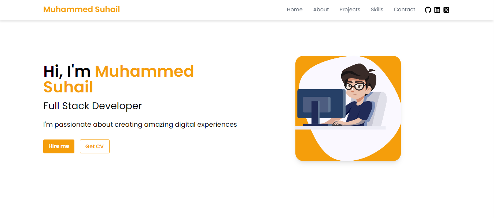

# 🚀 My Portfolio

A modern, responsive portfolio website built with React, showcasing my projects and skills.

## 🌟 Features

- 📱 Fully responsive design
- 🎨 Modern and sleek UI
- 🚀 Smooth animations
- 📧 Contact form with EmailJS integration
- 🔔 Toast notifications using React Hot Toast
- 📊 Interactive project showcase
- 💼 Skills and experience section

## 🛠️ Technologies Used

- [React](https://reactjs.org/)
- [React Icons](https://react-icons.github.io/react-icons/)
- [React Hot Toast](https://react-hot-toast.com/)
- [EmailJS](https://www.emailjs.com/)
- [Framer Motion](https://www.framer.com/motion/) (for animations)

## 🚀 Quick Start

1. Clone the repository:
2. Navigate to the project directory:
3. Install dependencies:
4. Create a `.env` file in the root directory and add your EmailJS credentials:
5. Start the development server:
6. Open your browser and visit `http://localhost:5173`

## 🎨 Customization

- Update the `src/data/projects.js` file to add your own projects
- Modify the `src/styles/main.css` file to change the color scheme and typography
- Adjust animations in `src/utils/animations.js` to fit your preferences

## 📧 Contact Form Setup

1. Sign up for a free account at [EmailJS](https://www.emailjs.com/)
2. Create a new email service and template
3. Update the `.env` file with your EmailJS credentials
4. Modify the `Contact.js` component to handle form submission

## 🚀 Deployment

1. Build the project:
2. Deploy the `build` folder to your preferred hosting platform (e.g., Netlify, Vercel, or GitHub Pages)

## 📄 License

This project is open source and available under the [MIT License](LICENSE).

## 🤝 Contributing

Contributions, issues, and feature requests are welcome! Feel free to check the [issues page](https://github.com/yourusername/portfolio/issues).

## 👨‍💻 Author

**Your Name**

- GitHub: [@Suhail](https://github.com/mskcmd)
- LinkedIn: [Suhail](https://www.linkedin.com/in/muhammed-suhail-k-343748277/)
- Website: [Suhail](https://yourwebsite.com)

## 🙏 Acknowledgements

- [React Icons](https://react-icons.github.io/react-icons/)
- [React Hot Toast](https://react-hot-toast.com/)
- [EmailJS](https://www.emailjs.com/)
- [Framer Motion](https://www.framer.com/motion/)

---

⭐️ If you like this project, please give it a star on GitHub! ⭐️

